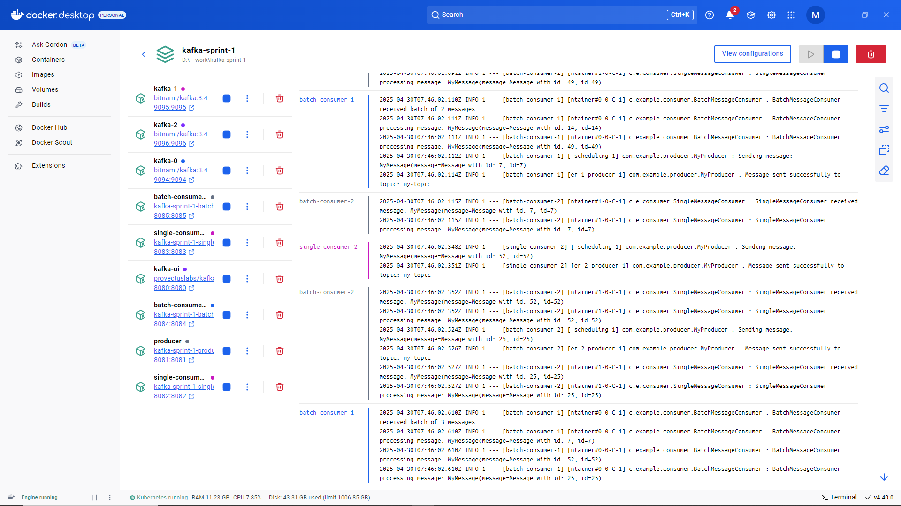
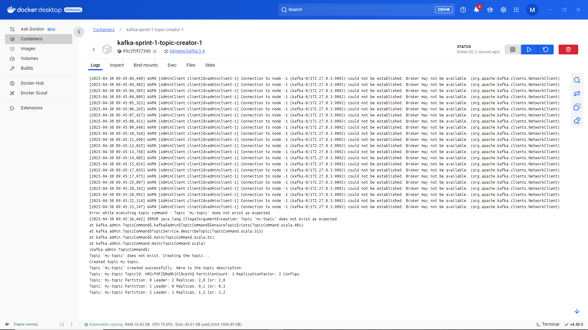
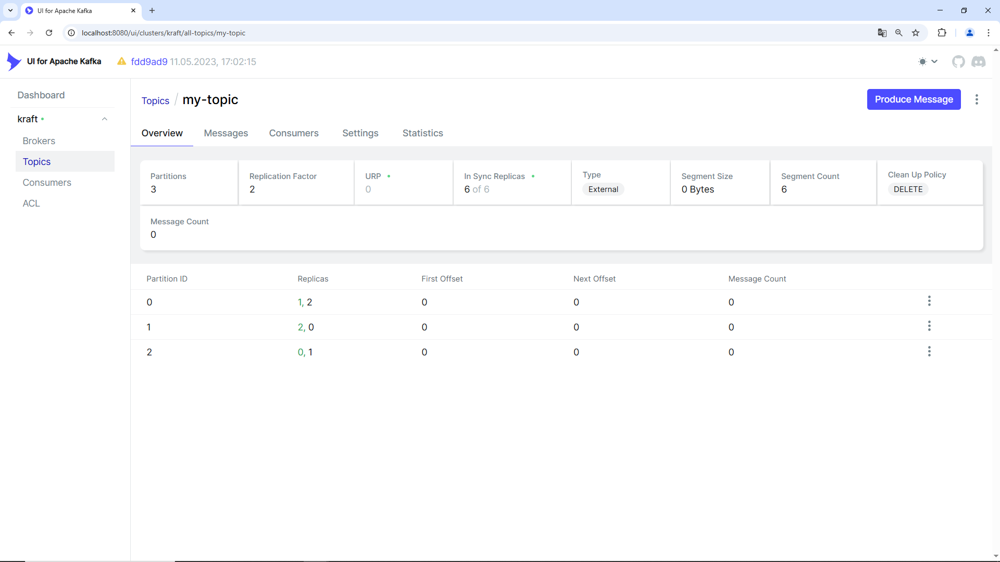
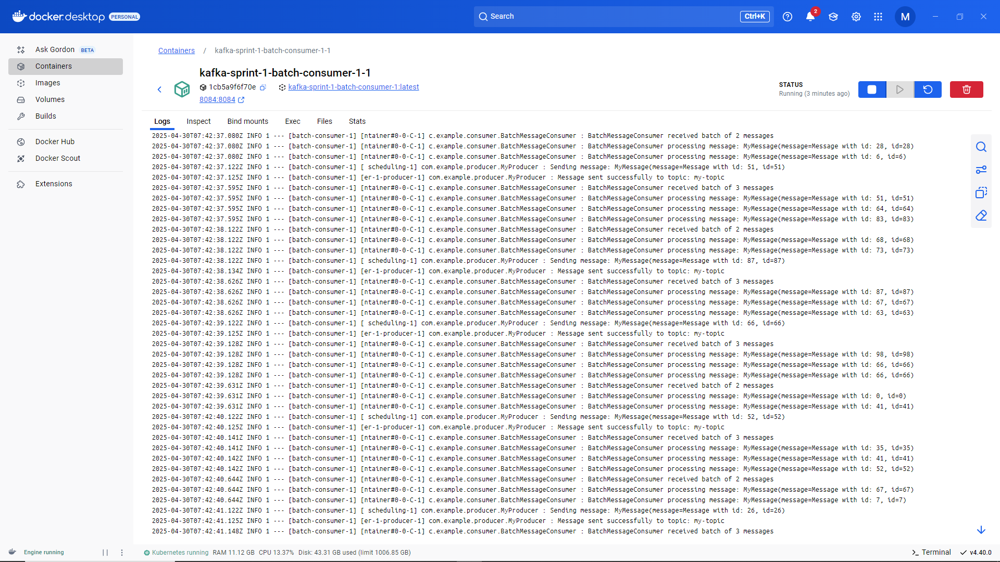
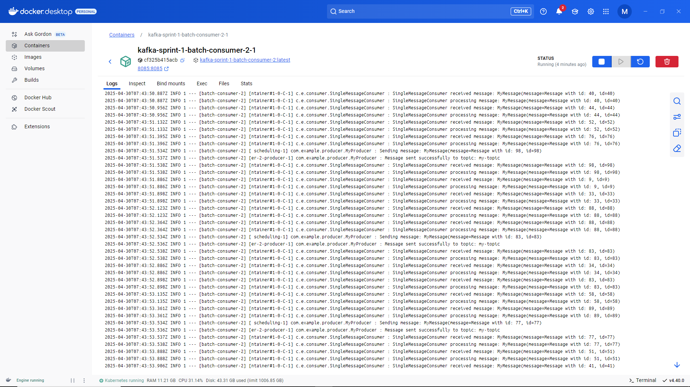
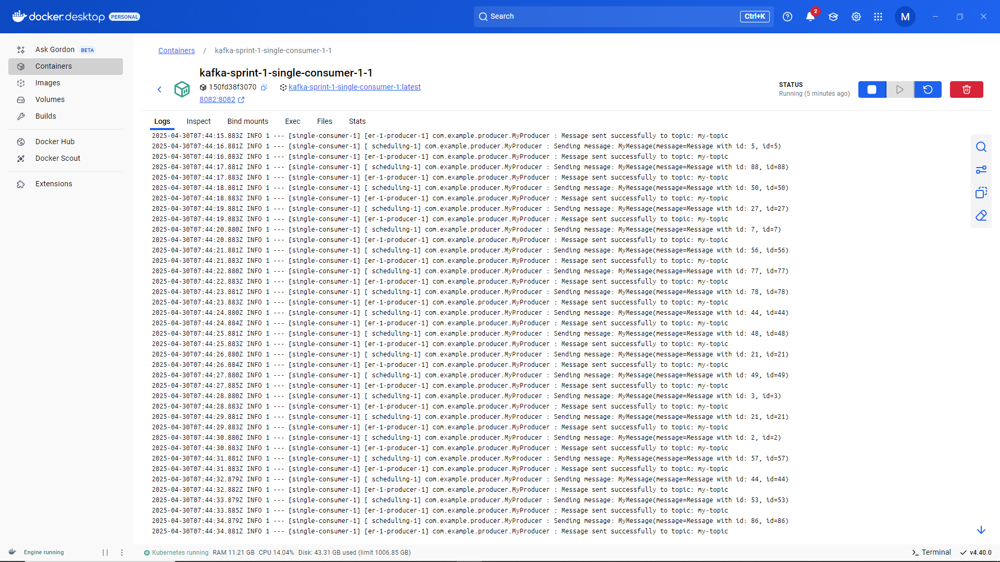
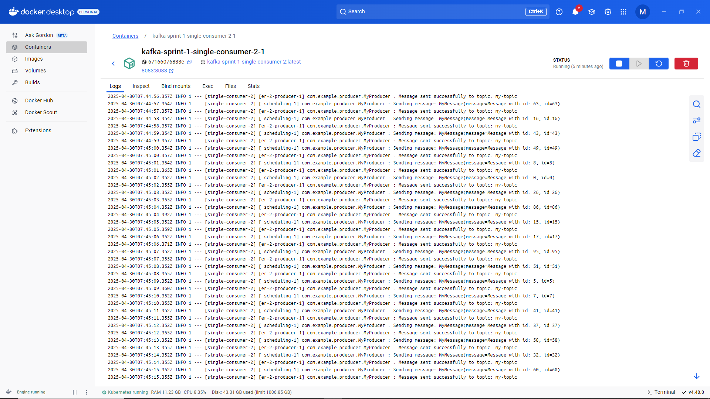

Приложение Kafka на языке Java с использованием Spring Boot, включающее в себя продюсера 
и двух типов консьюмеров: одиночного и пакетного. Каждый консьюмер запущен в двух экземплярах.
Также реализованы сериализация/десериализация и обеспечены гарантии доставки сообщений.

Необходимые инструменты и ПО:

•  Java Development Kit (JDK) 21 или новее.
•  Gradle (для управления зависимостями и сборки проекта).
•  Spring Boot: Используем Spring Initializr (start.spring.io) для создания нового проекта приложения. 
•  Docker и Docker Compose (для запуска Kafka).
•  Kafka (брокер сообщений, Kraft-режим).

ВАЖНО: 

Перед сборкой проекта, определите свой IP-адрес ...его, 
для успешного старта приложения, необходимо прописать 
в docker-compose.yml (в корневом каталоге )
во всех определениях сервисов Kafka вместо 0.0.0.0:

- KAFKA_CFG_ADVERTISED_LISTENERS=PLAINTEXT://kafka-0:9092,EXTERNAL://0.0.0.0:9094

Заменить все 0.0.0.0 на Ваш IP-адрес.

- KAFKA_CFG_ADVERTISED_LISTENERS=PLAINTEXT://kafka-0:9092,EXTERNAL://<ВАШ_IP_АДРЕС>:9094

Определение IP для Windows:
- Запустите cmd и введите:
```ipconfig```

Например, вывод:
```
Ethernet adapter Ethernet: 
  IPv4 Address . . . . . . . . . : 192.168.X.Y
```
Здесь, ваш IP-адрес — 192.168.X.Y

Аналогично в Linux:
```ip addr show```

После внесение корректировок в docker-compose.yml, соберите и запустите 
контейнеры с помощью Docker Compose из корневого каталога проекта:

```docker-compose up --build```

Проект будет собран автоматически, исходя из Dockerfile в корневом каталоге и docker-compose.yml.

Для остановки и удаления контейнеров выполните:

```docker-compose down```

##Описание сервисов приложения

Настройка сервисов Kafka (см. docker-compose.yml):

```
services:
  kafka-0:
    image: bitnami/kafka:3.4
    ports:
      - "9094:9094"
    environment:
      - KAFKA_ENABLE_KRAFT=yes
      - KAFKA_CFG_PROCESS_ROLES=broker,controller
      - KAFKA_CFG_CONTROLLER_LISTENER_NAMES=CONTROLLER
      - ALLOW_PLAINTEXT_LISTENER=yes
      - KAFKA_CFG_NODE_ID=0
      - KAFKA_CFG_CONTROLLER_QUORUM_VOTERS=0@kafka-0:9093,1@kafka-1:9093,2@kafka-2:9093
      - KAFKA_KRAFT_CLUSTER_ID=abcdefghijklmnopqrstuv
      - KAFKA_CFG_LISTENERS=PLAINTEXT://:9092,CONTROLLER://:9093,EXTERNAL://:9094
      - KAFKA_CFG_ADVERTISED_LISTENERS=PLAINTEXT://kafka-0:9092,EXTERNAL://192.168.182.42:9094
      - KAFKA_CFG_LISTENER_SECURITY_PROTOCOL_MAP=CONTROLLER:PLAINTEXT,EXTERNAL:PLAINTEXT,PLAINTEXT:PLAINTEXT   
    volumes:
      - kafka_0_data:/bitnami/kafka
    networks:
      - kafka-net  
   
  kafka-1:
    image: bitnami/kafka:3.4
    ports:
      - "9095:9095"
    environment:
      - KAFKA_ENABLE_KRAFT=yes
      - ALLOW_PLAINTEXT_LISTENER=yes
      - KAFKA_CFG_NODE_ID=1
      - KAFKA_CFG_PROCESS_ROLES=broker,controller
      - KAFKA_CFG_CONTROLLER_LISTENER_NAMES=CONTROLLER
      - KAFKA_CFG_CONTROLLER_QUORUM_VOTERS=0@kafka-0:9093,1@kafka-1:9093,2@kafka-2:9093
      - KAFKA_KRAFT_CLUSTER_ID=abcdefghijklmnopqrstuv
      - KAFKA_CFG_LISTENERS=PLAINTEXT://:9092,CONTROLLER://:9093,EXTERNAL://:9095
      - KAFKA_CFG_ADVERTISED_LISTENERS=PLAINTEXT://kafka-1:9092,EXTERNAL://192.168.182.42:9095
      - KAFKA_CFG_LISTENER_SECURITY_PROTOCOL_MAP=CONTROLLER:PLAINTEXT,EXTERNAL:PLAINTEXT,PLAINTEXT:PLAINTEXT   
    volumes:
      - kafka_1_data:/bitnami/kafka
    networks:
      - kafka-net
   
  kafka-2:
    image: bitnami/kafka:3.4
    ports:
      - "9096:9096"
    environment:
      - KAFKA_ENABLE_KRAFT=yes
      - ALLOW_PLAINTEXT_LISTENER=yes
      - KAFKA_CFG_NODE_ID=2
      - KAFKA_CFG_PROCESS_ROLES=broker,controller
      - KAFKA_CFG_CONTROLLER_LISTENER_NAMES=CONTROLLER
      - KAFKA_CFG_CONTROLLER_QUORUM_VOTERS=0@kafka-0:9093,1@kafka-1:9093,2@kafka-2:9093
      - KAFKA_KRAFT_CLUSTER_ID=abcdefghijklmnopqrstuv
      - KAFKA_CFG_LISTENERS=PLAINTEXT://:9092,CONTROLLER://:9093,EXTERNAL://:9096
      - KAFKA_CFG_ADVERTISED_LISTENERS=PLAINTEXT://kafka-2:9092,EXTERNAL://192.168.182.42:9096
      - KAFKA_CFG_LISTENER_SECURITY_PROTOCOL_MAP=CONTROLLER:PLAINTEXT,EXTERNAL:PLAINTEXT,PLAINTEXT:PLAINTEXT
    volumes:
      - kafka_2_data:/bitnami/kafka   
    networks:
      - kafka-net
   
  topic-creator:
    image: bitnami/kafka:3.4
    depends_on:
      - kafka-0
      - kafka-1
      - kafka-2
    volumes:
      - ./scripts/create-topic.sh:/create-topic.sh
    entrypoint: /bin/bash /create-topic.sh
    networks:
      - kafka-net

networks:
  kafka-net:
    driver: bridge

volumes:
  kafka_0_data:
  kafka_1_data:
  kafka_2_data:
```

Мы определили несколько сервисов Kafka в среде Docker с использованием образа bitnami/kafka:3.4. Настройки оптимизированы для работы в режиме KRaft (Kafka Raft), который не требует Zookeeper. Конфигурация включает три брокера Kafka, которые работают вместе в кластере, а также дополнительный сервис для создания тем.

### Описание каждого сервиса

#### 1. Сервисы Kafka
Каждый сервис kafka-0, kafka-1 и kafka-2 имеет схожую конфигурацию с некоторыми отличиями. Рассмотрим каждый из них:

- Образ: Используется образ bitnami/kafka:3.4, который обеспечивает стандартную реализацию Kafka.
- Порты: Каждый брокер открывает свои порты на хост-машине:
  - kafka-0: 9094
  - kafka-1: 9095
  - kafka-2: 9096
- Переменные окружения: 
  - KAFKA_ENABLE_KRAFT: Включает режим KRaft (Kafka Raft).
  - KAFKA_CFG_PROCESS_ROLES: Указывает, что брокер будет работать как брокер и контроллер.
  - Кластерный контроллер: KAFKA_CFG_CONTROLLER_QUORUM_VOTERS указывает всех членов кворума для контроллера.
  - Слушатели: Настройки KAFKA_CFG_LISTENERS и KAFKA_CFG_ADVERTISED_LISTENERS определяют, как брокеры принимают соединения и как они представляются другим участникам сети.
  - Объём данных: Каждому брокеру предоставляется собственный том для хранения данных (kafka_0_data, kafka_1_data, kafka_2_data).
- Сеть: Все брокеры подключены к сети kafka-net, что позволяет им взаимодействовать друг с другом.

#### 2. Сервис создания тем (topic-creator)
- Образ: Использует тот же образ Kafka, что и брокеры.
- Зависимости: Cервис зависит от всех брокеров Kafka. Это гарантирует, что все они будут запущены перед выполнением скрипта создания тем.
- Скрипт: Скрипт create-topic.sh, который создает темы, монтируется как том, чтобы быть доступным внутри контейнера.
- Entrypoint: При запуске контейнера выполняется скрипт /create-topic.sh, т.е. он будет создавать необходимые темы, при необходимости, в случае их отсутствия, сразу после инициирования.

### 3. Сеть
- Кастомная сеть: Объявлена сеть kafka-net с драйвером bridge, что позволяет контейнерам общаться между собой.

### 4. Объёмы
- Для каждого брокера создается отдельный объём (kafka_0_data, kafka_1_data, kafka_2_data), что гарантирует, что данные будут сохраняться и после завершения работы контейнеров.

Конфигурация создает кластер Kafka из трех брокеров с возможностью работы в режиме KRaft. Также предусмотрен сервис, который автоматически создает необходимые темы при старте кластера.

Автоматическое создание темы после старта сервисов Kafka:

```
#!/bin/bash

# Определяем имя темы
TOPIC_NAME="my-topic"

# Проверка существования темы
if /opt/bitnami/kafka/bin/kafka-topics.sh --describe --topic "$TOPIC_NAME" --bootstrap-server kafka-0:9092; then
    echo "Topic '$TOPIC_NAME' already exists."
else
    echo "Topic '$TOPIC_NAME' does not exist. Creating the topic..."
    # Создаем новую тему, если она не существует
    /opt/bitnami/kafka/bin/kafka-topics.sh --create --topic "$TOPIC_NAME" --partitions 3 --replication-factor 2 --bootstrap-server kafka-0:9092
    echo "Topic '$TOPIC_NAME' created successfully. Here is the topic description:"
    # Выводим описание вновь созданной темы
    /opt/bitnami/kafka/bin/kafka-topics.sh --describe --topic "$TOPIC_NAME" --bootstrap-server kafka-0:9092
fi
```

### Создание темы: my-topic

1. Имя темы: 
   - my-topic — уникальное имя, под которым будет зарегистрирована и доступна тема в Kafka.

### Параметры создания темы

При создании темы используются следующие параметры:

- Параметр: --partitions 3
	Тема будет разделена на три логических сегмента (партиции), что позволяет обрабатывать сообщения параллельно. Это увеличивает производительность, поскольку разные потребители могут читать из разных партиций одновременно.

- Параметр: --replication-factor 2
	Определяет количество реплик (резервных копий) каждой партиции в кластере. Каждая партиция темы будет иметь одну основную реплику (лидер) и одну резервную реплику. Это гарантирует высокую доступность данных. Если один из брокеров выйдет из строя, данные все еще будут доступны на другой реплике.

- Параметр: --bootstrap-server kafka-0:9092
	Указывает адрес сервера Kafka, к которому будет осуществляться подключение для создания темы, т.е. команда будет выполнять запросы к брокеру kafka-0, работающему на порту 9092. Это также позволяет автоматически обнаружить других брокеров в кластере, если они уже настроены для работы с этой темой.
	
Так же тема может быть создана вручную в контейнере.

Определяем <KAFKA_CONTAINER_NAME>:

```docker ps -a```

И создаём тему внутри Kafka контейнера:

```docker exec -it <KAFKA_CONTAINER_NAME> bash -c "/opt/bitnami/kafka/bin/kafka-topics.sh --delete --topic my-topic --bootstrap-server localhost:9092"```

  •  --create: Указывает на создание нового topic.
  •  --bootstrap-server localhost:9092: Адрес и порт Kafka Broker.
  •  --replication-factor 2: Каждое сообщение будет скопировано на 2 разных broker-а для отказоустойчивости.
  •  --partitions 3: topic будет разделен на 3 партиции для параллельной обработки.
  •  --topic my-topic: Имя topic.

#### 3. Описание сервисов приложения

Описание сервисов приложения (в соответствии с фактором репликации 2 для потребителей) (см. docker-compose.yml):

```
  producer:
    build: .
    depends_on:
      - kafka-0
      - kafka-1
      - kafka-2
    ports:
      - "8081:8081"
    environment:
      - SPRING_PROFILES_ACTIVE=producer
      - KAFKA_BOOTSTRAP_SERVERS=kafka-0:9092,kafka-1:9092,kafka-2:9092
    networks:
      - kafka-net

  single-consumer-1:
    build: .
    depends_on:
      - kafka-0
      - kafka-1
      - kafka-2
    ports:
      - "8082:8082"
    environment:
      - SPRING_PROFILES_ACTIVE=single-consumer-1
      - KAFKA_BOOTSTRAP_SERVERS=kafka-0:9092,kafka-1:9092,kafka-2:9092
    networks:
      - kafka-net

  single-consumer-2:
    build: .
    depends_on:
      - kafka-0
      - kafka-1
      - kafka-2
    ports:
      - "8083:8083"
    environment:
      - SPRING_PROFILES_ACTIVE=single-consumer-2
      - KAFKA_BOOTSTRAP_SERVERS=kafka-0:9092,kafka-1:9092,kafka-2:9092
    networks:
      - kafka-net

  batch-consumer-1:
    build: .
    depends_on:
      - kafka-0
      - kafka-1
      - kafka-2
    ports:
      - "8084:8084"
    environment:
      - SPRING_PROFILES_ACTIVE=batch-consumer-1
      - KAFKA_BOOTSTRAP_SERVERS=kafka-0:9092,kafka-1:9092,kafka-2:9092
    networks:
      - kafka-net

  batch-consumer-2:
    build: .
    depends_on:
      - kafka-0
      - kafka-1
      - kafka-2
    ports:
      - "8085:8085"
    environment:
      - SPRING_PROFILES_ACTIVE=batch-consumer-2
      - KAFKA_BOOTSTRAP_SERVERS=kafka-0:9092,kafka-1:9092,kafka-2:9092
    networks:
      - kafka-net
```

Пояснения:
  •  Параметр KAFKA_ADVERTISED_HOST_NAME (см. ранее) будет доступен для контейнеров producer и consumer.
  •  producer, single-consumer-1, single-consumer-2, batch-consumer-1, batch-consumer-2: Сервисы, запускающие Spring Boot приложение с разными профилями. depends_on гарантирует, что Kafka будет запущен перед запуском приложения.
  •  build: .: Указывает, что Dockerfile находится в текущей директории. см. Dockerfile для сборки и старта приложения в корне проекта.
  
```
FROM openjdk:21-jdk-slim AS builder

WORKDIR /app

# Копируем файлы Gradle
COPY gradle gradle
COPY gradlew gradlew
COPY settings.gradle settings.gradle
COPY build.gradle build.gradle

# Копируем исходный код
COPY src src

# Запускаем сборку Gradle
RUN ./gradlew clean build -x test

# Этап запуска приложения
FROM openjdk:21-jdk-slim

WORKDIR /app

# Копируем собранный JAR файл
COPY --from=builder /app/build/libs/KafkaApp-0.0.1-SNAPSHOT.jar app.jar

# Запускаем приложение
ENTRYPOINT ["java","-jar","app.jar"]
```
  •  ports: Пробрасывает порты из контейнера на хост-машину для доступа к сервисам.
  •  environment: Устанавливает переменные окружения для сервисов. SPRING_PROFILES_ACTIVE указывает, какой профиль Spring будет активирован. Например application-batch-consumer-2.yml:
  
```
spring:
  application:
    name: batch-consumer-2
  kafka:
    bootstrap-servers: ${KAFKA_BOOTSTRAP_SERVERS:kafka-0:9092,kafka-1:9092,kafka-2:9092}
    topic: my-topic
    group:
      batch: batch-consumer-group-2
```

Мониторинг сервисов Kafka настраивается (см. docker-compose.yml):

```  
  kafka-ui:
    image: provectuslabs/kafka-ui:v0.7.0
    depends_on:
      - kafka-0
      - kafka-1
      - kafka-2
    ports:
      - "8080:8080"
    environment:
      KAFKA_CLUSTERS_0_NAME: kraft
      KAFKA_CLUSTERS_0_BOOTSTRAP_SERVERS: kafka-0:9092,kafka-1:9092,kafka-2:9092
    networks:
      - kafka-net
```

### Описание структуры проекта/приложения:

```
  kafka-app/
  ├── src/
  │  └── main/
  │    └── java/
  │      └── com/
  │        └── example/
  │          ├── KafkaApp.java
  │          ├── config/
  │          │  └── KafkaConfig.java
  │          ├── model/
  │          │  └── MyMessage.java
  │          ├── producer/
  │          │  └── MyProducer.java
  │          ├── consumer/
  │          │  ├── SingleMessageConsumer.java
  │          │  └── BatchMessageConsumer.java
  │          └── serializers/
  │            ├── MyMessageSerializer.java
  │            └── MyMessageDeserializer.java
  │    └── resources/
  │       ├── application.yml 
  │       ├── application-batch-consumer-1.yml 
  │       └── ...
  ├── src/
  │  └── test/
  │    └── java/
  │      └── com/
  │        └── example/
  │          └── ...
  ├── scripts/
  │  └── create-topic.sh
  ├── images/
  │  └── ...
  ├── build.gradle
  ├── settings.gradle 
  ├── Dockerfile 
  ├── docker-compose.yml
  ├── README.md
  └── topic.txt
  
```

•  Создаём проект Spring Boot: Используем Spring Initializr (start.spring.io) или IDE для создания нового проекта Spring Boot.
•  Добавляем следующие зависимости в файл сборки build.gradle (Gradle):

```    dependencies {
        implementation 'org.springframework.boot:spring-boot-starter-web'
        implementation 'org.springframework.kafka:spring-kafka'
        compileOnly 'org.projectlombok:lombok'
        annotationProcessor 'org.projectlombok:lombok'
        implementation 'com.fasterxml.jackson.core:jackson-databind'
    }
```

•  Создаём файл настроек/конфигурации приложения application.yml (каталог ./src/main/resources):

```
kafka:
  bootstrap-servers: ${KAFKA_BOOTSTRAP_SERVERS:kafka-0:9092,kafka-1:9092,kafka-2:9092}
  topic: my-topic
  group:
    single: single-consumer-group
    batch: batch-consumer-group
```
	
  •  kafka.bootstrap-servers: Адрес Kafka Broker.
  •  kafka.topic: Имя topic, в который будут отправляться сообщения.
  •  kafka.group.single: Group ID для SingleMessageConsumer.
  •  kafka.group.batch: Group ID для BatchMessageConsumer.

И соответствующие файлы для конфигураций приложения (application-batch-consumer-1.yml, application-batch-consumer-2.yml, application-single-consumer-1.yml, application-single-consumer-2.yml)

При успешной работе/настройке, старте приложения (всех сервисов) можем видеть (для Windows, Docker Compose):



Успешный вывод при автоматическом создании темы см.:



Также доступен мониторинг приложения посредсивом Kafka UI:



В файлах журналов при этом в соответствующих сервисах:







